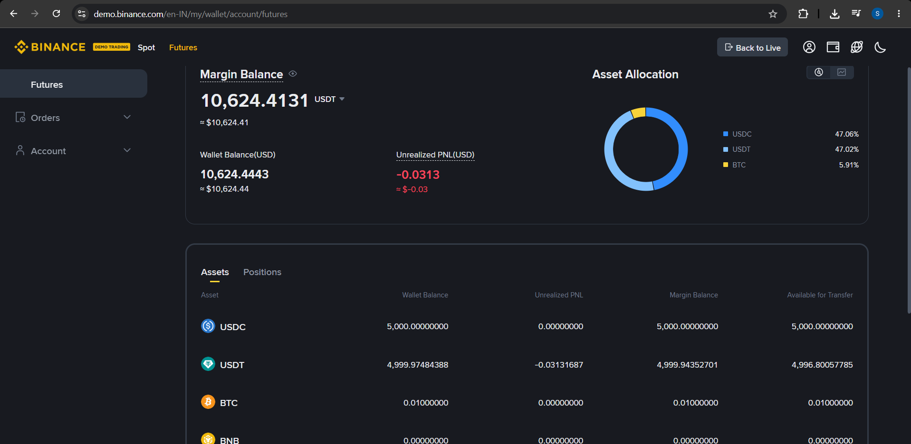

# Binance Futures Testnet Trading Bot

A simplified CLI trading bot that places MARKET, LIMIT, and STOP_LIMIT orders
on Binance Futures Testnet / Demo Trading (USDT-M), with structured code,
input validation, logging, and an optional interactive menu UX.

## Project Structure

```
trading_bot/
  bot/
    __init__.py
    client.py          # Binance client wrapper (API layer)
    orders.py          # Order placement / result formatting logic
    validators.py       # Input validation
    logging_config.py   # Logging setup
  cli.py                # CLI entry point (command layer)
  demo_dry_run.py        # Mocked demo - no real API calls, no keys needed
  logs/
    trading_bot.log       # Generated at runtime
  assets/
    binance-demo-order-proof.png  # Demo wallet screenshot after orders
  README.md
  requirements.txt
  .env.example
```

## Setup

### 1. Get Demo / Testnet API credentials

> **Note:** Binance migrated Futures Testnet off `testnet.binancefuture.com`
> to **Demo Trading**. API base URL used by this bot:
> `https://demo-fapi.binance.com` (via `python-binance` `Client(..., demo=True)`).

1. Open **https://demo.binance.com** (incognito is fine).
2. Log in (GitHub login works; use the Demo Trading account, not live keys).
3. Profile → **API Management** / **Demo Trading API** → **Create API**
   (System Generated is fine).
4. Copy the **API Key** and **Secret Key**. Save the secret now — it is shown once.
5. Optional: open the Futures demo UI and confirm you have a USDT demo balance.
   If balance is **0**, use the **Faucet** in the Assets panel on
   **https://demo.binance.com/en/futures** → select **USDT** → **Add Asset**
   (credits ~1,000 USDT demo funds).

### 2. Install dependencies (Python 3.9+)

```bash
pip install -r requirements.txt
```

### 3. Set API credentials (environment variables — never hardcode)

**Windows PowerShell (current session only):**
```powershell
$env:BINANCE_TESTNET_API_KEY="your_key_here"
$env:BINANCE_TESTNET_API_SECRET="your_secret_here"
```

**macOS / Linux:**
```bash
export BINANCE_TESTNET_API_KEY="your_key_here"
export BINANCE_TESTNET_API_SECRET="your_secret_here"
```

Or copy `.env.example` → `.env` and load it yourself; `.env` is gitignored.

## Usage

### Interactive mode (enhanced CLI UX — bonus)
Run with no flags for a menu, prompts, retry-on-error, and confirm-before-place:
```bash
python cli.py
# or
python cli.py --interactive
```

### Place a MARKET order (flag mode)
```bash
python cli.py --symbol BTCUSDT --side BUY --type MARKET --quantity 0.001
```

### Place a LIMIT order (flag mode)
(Use a price far from market so it rests as `NEW` and does not fill immediately.)
```bash
python cli.py --symbol BTCUSDT --side SELL --type LIMIT --quantity 0.001 --price 150000
```

### Place a STOP_LIMIT order (bonus)
Triggers a LIMIT sell when price hits `--stop-price`, then posts at `--price`.
Use a stop price *below* the current market for a sell stop-limit so it rests
without triggering immediately.
```bash
python cli.py --symbol BTCUSDT --side SELL --type STOP_LIMIT --quantity 0.001 --price 58000 --stop-price 59000
```

### Arguments (flag mode)
| Flag | Required | Notes |
|---|---|---|
| `--symbol` | yes* | e.g. `BTCUSDT` |
| `--side` | yes* | `BUY` or `SELL` (case-insensitive) |
| `--type` | yes* | `MARKET`, `LIMIT`, or `STOP_LIMIT` |
| `--quantity` | yes* | must be > 0 |
| `--price` | LIMIT / STOP_LIMIT | must be > 0 |
| `--stop-price` | STOP_LIMIT only | trigger price; must be > 0 |
| `-i` / `--interactive` | no | force interactive menu |

\*Required only in flag mode. Interactive mode prompts for these.

Every run prints an order request summary, the API response (orderId,
status, executedQty, avgPrice), and a success/failure message. All requests,
responses, and errors are also written to `logs/trading_bot.log`.

## Dry-run demo (no API keys needed)

`demo_dry_run.py` mocks the Binance client layer so you can see the full
request → log → response → summary pipeline without credentials:

```bash
python demo_dry_run.py
```

For the submission, prefer real demo-API log lines (real `orderId` values)
from running `cli.py` after setting credentials.

## Proof of demo trading activity

Orders placed by this bot are visible on the Binance **Demo Trading** Futures
wallet (balance / positions change after MARKET fills). Screenshot from the
demo dashboard after placing orders via `cli.py`:



Supporting API evidence is also in [`logs/trading_bot.log`](logs/trading_bot.log)
(real `orderId` / `algoId` values for MARKET, LIMIT, and STOP_LIMIT).

## Error handling

- **Invalid input** (bad symbol format, non-numeric quantity/price, missing
  price on a LIMIT order, invalid side/type) is caught by `bot/validators.py`
  before any API call is made, and reported clearly without a stack trace.
- **API errors** (e.g. insufficient demo balance, invalid symbol on
  Binance's side, bad precision) are caught around the `futures_create_order`
  call and surfaced as a clean failure message.
- **Network failures** (timeouts, connection errors) are caught by the same
  handler and logged with a full traceback in the log file for debugging,
  while the console only shows a short message.

## Assumptions

- Binance's current Futures "testnet" is Demo Trading at
  `https://demo-fapi.binance.com` (the old `testnet.binancefuture.com` host
  is deprecated). Env var names keep the `BINANCE_TESTNET_*` prefix from the
  assignment for familiarity.
- Orders use `timeInForce=GTC` for LIMIT and STOP_LIMIT orders (not exposed
  as a flag, to keep the CLI surface small).
- CLI type `STOP_LIMIT` maps to Binance futures type `STOP`. Since Dec 2025,
  conditional orders go through `POST /fapi/v1/algoOrder` (python-binance
  handles this and maps `stopPrice` → `triggerPrice`). Response may use
  `algoId` / `algoStatus` instead of `orderId` / `status`.
- Quantity/price precision (tick size, lot size) is left to Binance's own
  validation; the app does not pre-round to each symbol's exchange filters.
- Only USDT-M futures are targeted, per the task spec.
- Credentials are read from environment variables rather than passed as CLI
  flags, to avoid leaking secrets into shell history / git.

## Bonus implemented

1. **Stop-Limit orders** — `--type STOP_LIMIT` with `--price` and `--stop-price`
   (routed via Binance Algo Order API).
2. **Enhanced CLI UX** — run `python cli.py` for a menu, field-by-field prompts,
   clear validation retries, order preview, and confirm-before-place. Flag mode
   still works for scripting.

Other optional bonuses (OCO/TWAP/Grid, lightweight UI) were left out to keep
the submission focused.


